Authors: Mattia Basaglia

# Bouncing Ball

The bouncing ball animation is a common starting point for many animators,
as it serves as a simple yet effective demonstration of motion and timing.

This tutorial will guide you through the process of creating a
bouncing ball animation in Glaxnimate. So let's get started!

{lottie:bouncy-ball/ball-final.json:512:512:ball-final.rawr}

Create a new project
--------------------

When you start Glaxnimate a dialog with default templates shows up,
here select Telegam Sticker and ensure the framerate is 60 fps and the duration is 2 seconds.

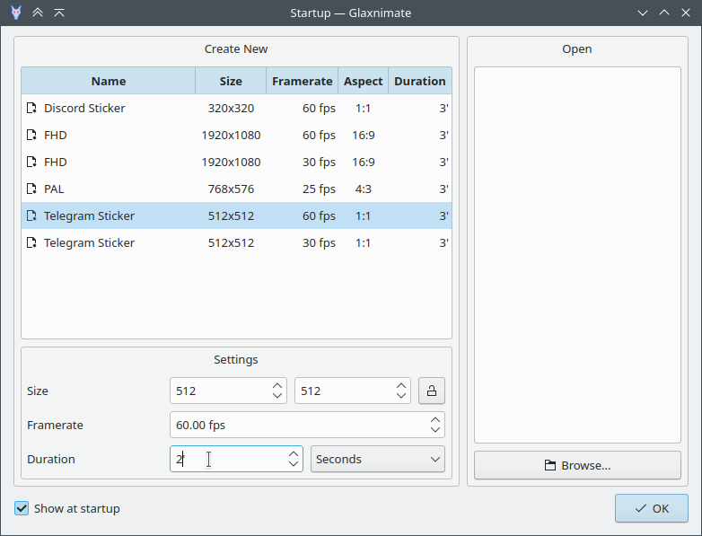

If you don't see the dialog, you can create a new file,
then change the timing in _Document_ > _Timing_ as follows:

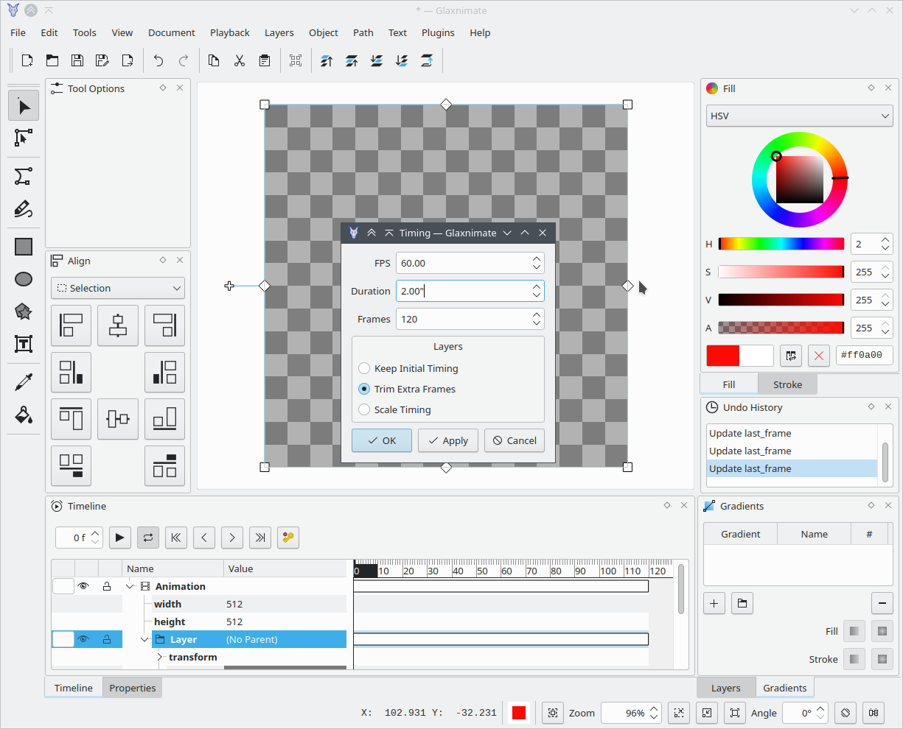

Creating the Ball
-----------------

Draw a circle shape to represent the ball.
You can do this by selecting the "Ellipse" tool from the toolbar,
then clicking and dragging the cursor to create a circle of the desired size.
If you hold Ctrl, Glaxnimate will ensure the ellipse is a perfect circle.

You can then switch to the edit tool and ensure the ellipse to is selected.

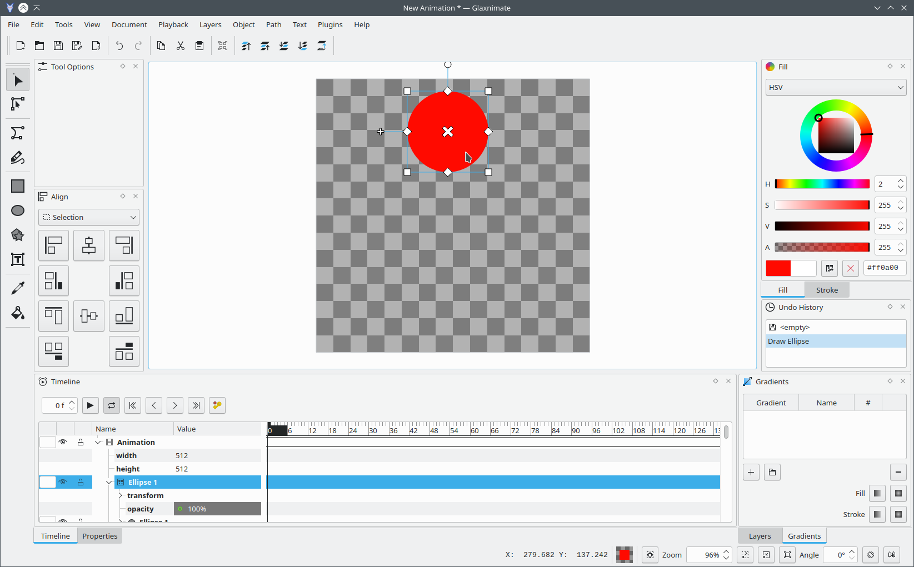

Basic Animation Loop
--------------------

On the timeline view below the canvas, you can expand the tree to view the properties of an ellipse.

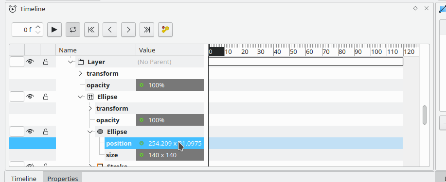

To add the first keyframe, right click on the **position** row under the
ellipse shape and select "Add Keyframe" from the context menu.

Then move the timeline to frame 60 and drag the ellipse down
(or edit the position value on the timeline) and add another keyframe.

Finally, right click on the position row again and make it a looping animation.
This last step copies the value of the first keyframe at the end of the animation.

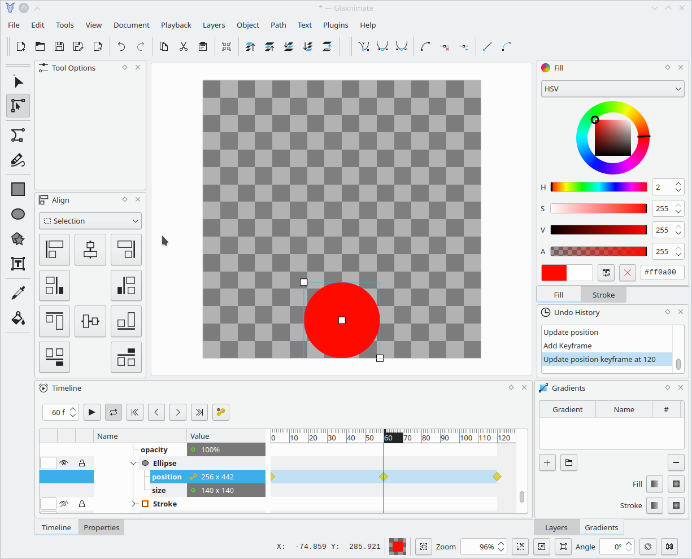

If you play the animation back, you'll see the ball moving up and down like so:

{lottie:bouncy-ball/ball-stiff.json:512:512:ball-stiff.rawr}

It works but the animation feels a bit stiff, because the ball is moving at a constant speed.

Easing
------

You could add more keyframes to represent the acceleration of the ball
but there's an easier way: changing the easing curve of the keyframe.

Right click on the first keyframe in the timeline and change
"Transition to Next" to "Ease".
Similarly, select the last keyframe and set the "Transition from Previous"
also to "Ease".

What this does is make the ball speed up as it leaves the first keyframe
and slow down to reach the last.

{lottie:bouncy-ball/ball-smooth.json:512:512:ball-smooth.rawr}

To make the effect more pronounced, we can use custom easing curves.

Follow the procedure as above, but select "Custom", then edit so the
keyframes easing curves look like these:

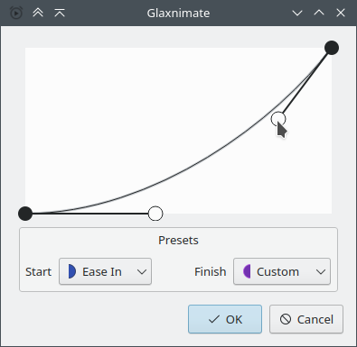

{lottie:bouncy-ball/ball-extra-smooth.json:512:512:ball-extra-smooth.rawr}

Squishing
---------

Currently the ball is not being deformed by the bounce, to make the animation even better,
we should change the size of the ellipse as it hits the bottom.

Setting all the keyframes manually is a bit tedious so we can enable the
keyframe recording mode, which automatically adds a keyframe whenever we make a change.

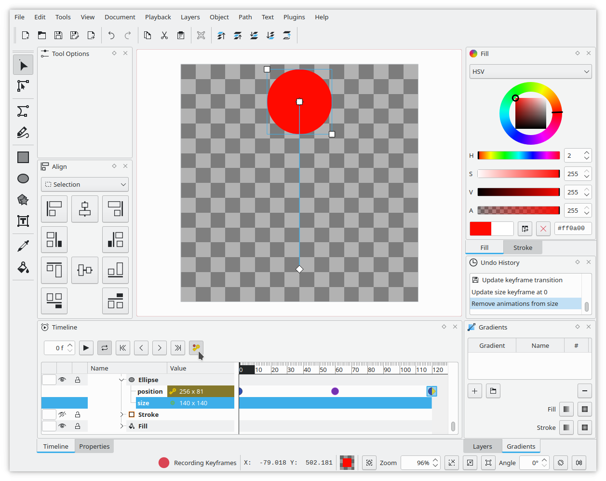

Now select a frame before the ball reaches the bottom of the canvas,
right click on the size and add a new keyframe,
then select the time at which the ball is at its lower point (it should be frame 60)
and change the size of the ball to make it wider and shorter,
then after a few frames, make the ball tall and skinny.

Finally, loop the animation as we did with the position and drag the last
keyframe towards the other.

In the end you should have something along these lines:

{lottie:bouncy-ball/ball-squish.json:512:512:ball-squish.rawr}

Multiple Bounces
----------------

Currently the animation consists of a single bounce of the ball, which is
fine for a simple example but sometimes you want to repeat an action or element
within the animation.

In order to achieve this, we will look at Precompositions, a feature that
allow you to group and organize objects into a single container,
making it easier to manage and duplicate your animation elements.

First, let's start by turning our animation layer into a precomposition:
Right click on **Layer** in the timeline, and select _Precompose_ from
the context menu.

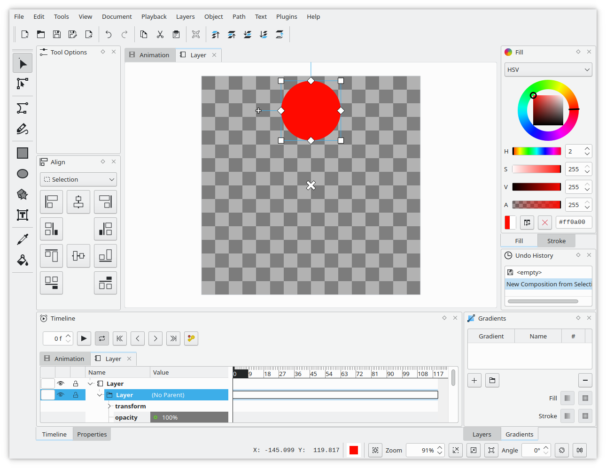

You'll notice now on top of the canvas you have two tabs, each tab
represents a composition. The first composition corresponds to the final
animation, and all the others are precompositions you can insert in the
main animation or even in other precompositions.

If you click on the **Animation** tab, you'll see the old shape layer
has been replaced by a composition layer.

The animation looks the same but now the layer behaves as a single uneditable object.

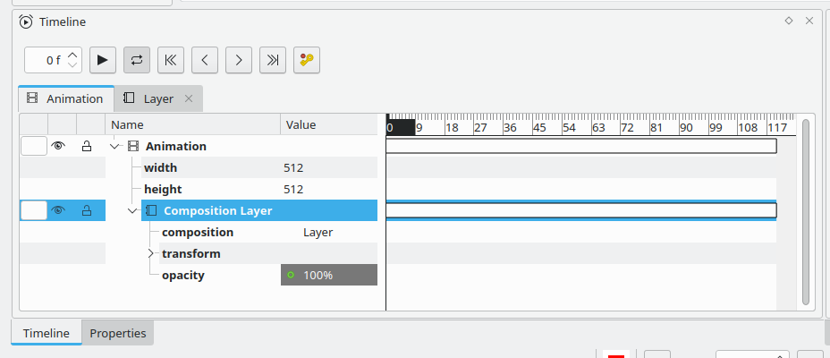

Now let's make the ball bounce twice as fast, in the main composition
you can drag the end time of the precomposed layer to end at frame 60:

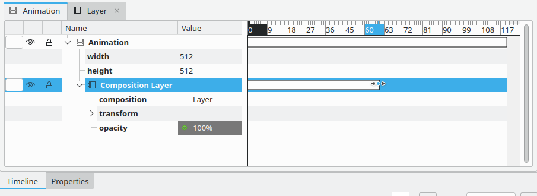

If you want more control, ensure you have the composition layer selected
and set the timing stretch to 50%:

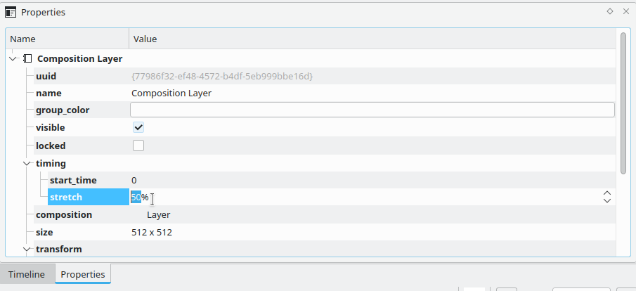

Now you can right click the composition layer in the timeline and select _Duplicate_.
Finally, drag the start time of the duplicated layer to frame 60, in a similar manner
as to which we modified the time stretch.

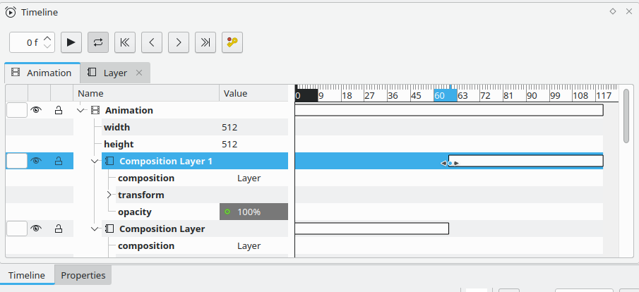

Now you have the ball bounce twice per animation loop:

{lottie:bouncy-ball/ball-twice.json:512:512:ball-twice.rawr}

Hit Lines
---------

We will now add some lines to highlight the hit when the ball reaches the bottom.

Within the precomposition (**Layer** tab), go to frame 60 (when the ball is at its lowest)
and use the _Draw Bezier_ tool to draw a line from the bottom of the ball out.
Make sure that in the tool options _Fill_ is unchecked and _Stroke_ is checked.
Simply click under the ball with the _Draw Bezier_ tool active and then click
again on the end of the line. Then press Enter on your keyboard to confirm the line.

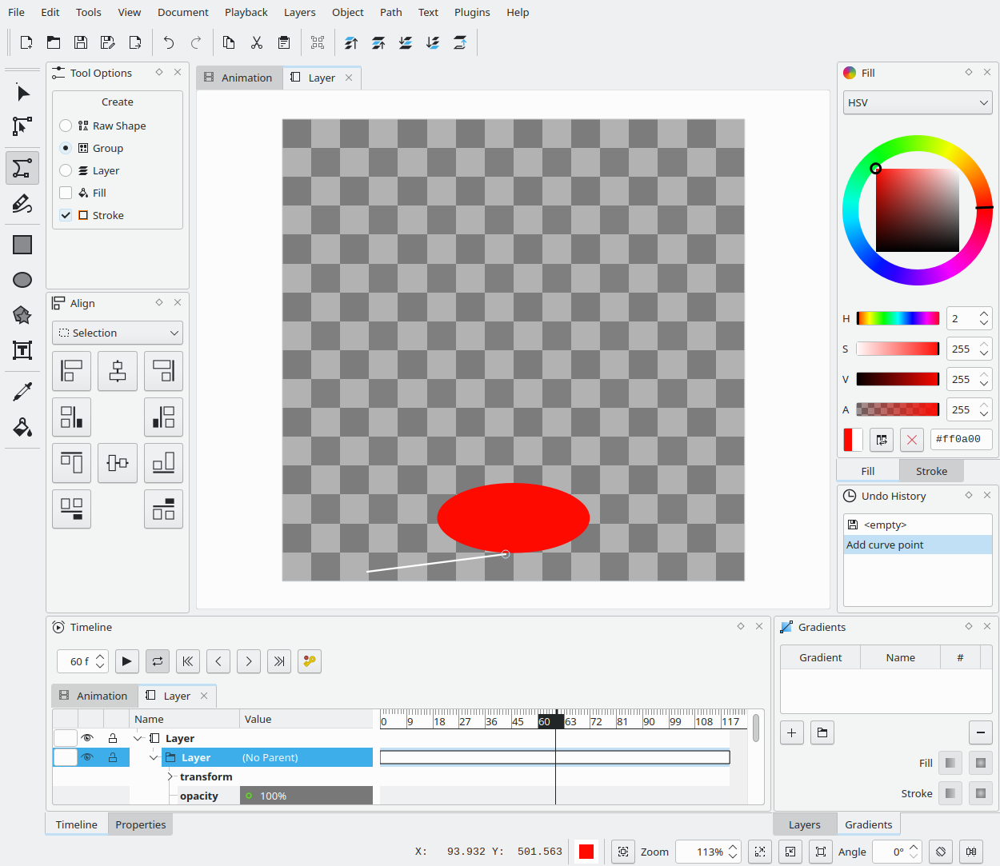

You can then use the _Stroke_ view to change the color and thickness of the line.

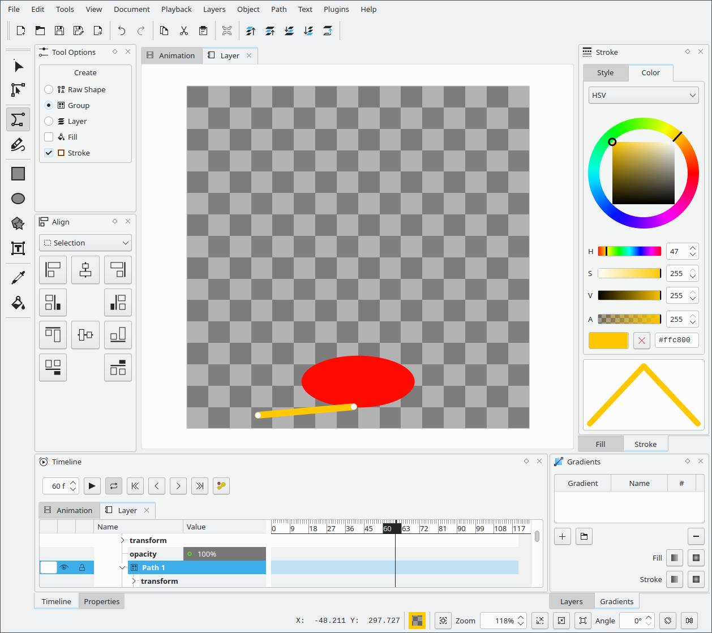

Draw a few more lines going in different directions making sure the staring point is towards the ball,
then select them all (with the _Select_ tool or from the timeline) and press Ctrl+G to group them.
Move the group below the ball by clicking on the _Lower to Bottom_ button
on the toolbar above the canvas.

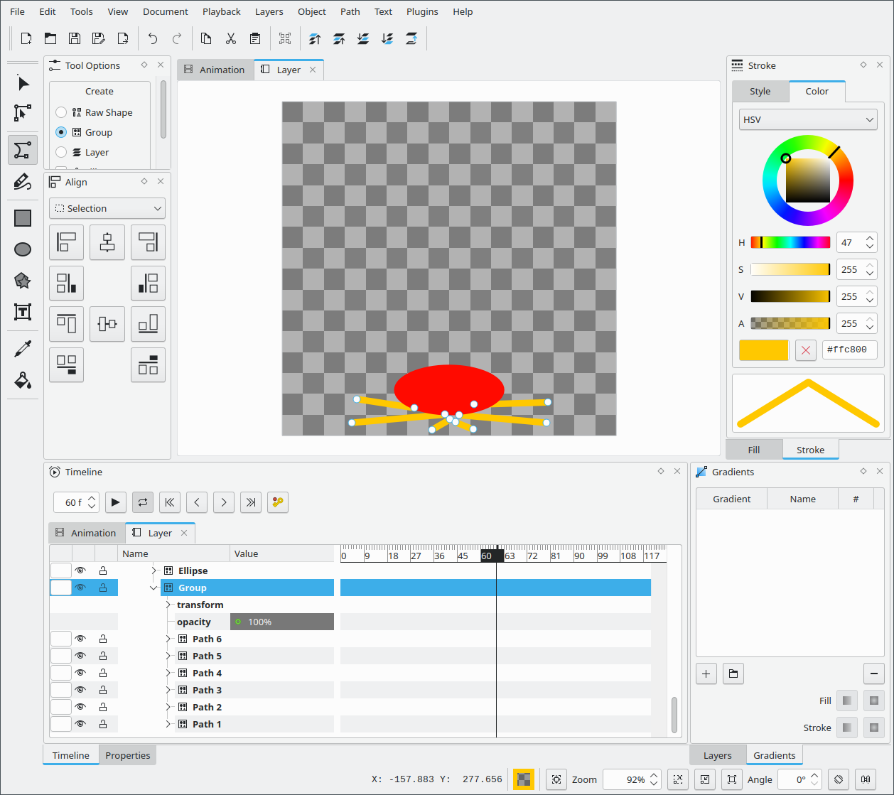

Now we'll animate the lines, making them appear and disappear in rapid succession.

Right click on the line group in the timeline, then _Add_ > _Trim Path_.
This will add a Trim Path at the bottom of the group, which gives you some
properties you can animate to modify the other paths in the group.

Expand **Trim Path** on the timeline, then animate its properties as we did with the ball.
At frame 60, both _start_ and _end_ should be keyframed at 0%,
this will make the lines invisible until that point.
After a few frames add set _start_ to 50% and _end_ to 100% and add a new keyframe for both.
After a few more frames add another keyframe and setting _start_ to 100%.

All this will make the lines briefly appear and shoot out when the ball hits the bottom.

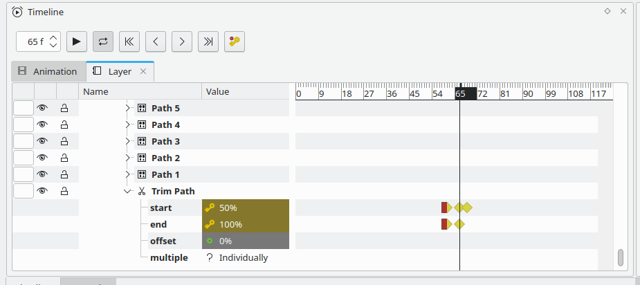

{lottie:bouncy-ball/ball-lines.json:512:512:ball-lines.rawr}
